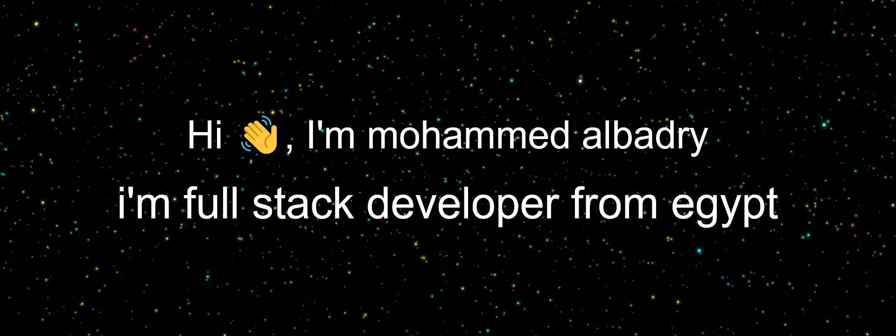

 

Hey there 👋

I’m Mohammed albadry, a full-stack developer from egypt, I build websites and create mobile applications API. Use clean code, fast performance, and security compatible with search engines.

Want to know more about me? [Check out my portfolio.](https://mohammedalbadry.com/)

 

## 📝 Good experience in basics
Familiar with computer science, algorithms, design patterns, object-oriented design, software principle, software engineering, data structure, and problem solving

## 🖥️ Frontend Skills

## 💡 backend Skills

## 🌍 General Skills

More Skills

 

## familiar with

